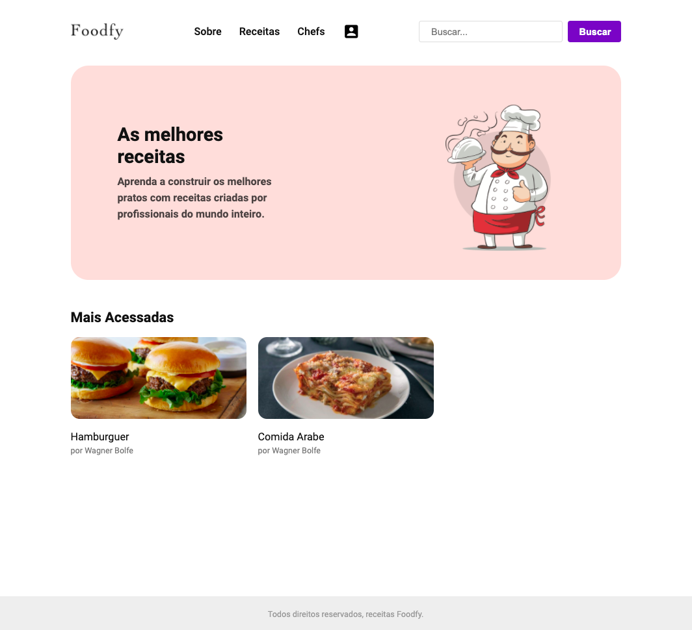

<h1 align="center" >
  Foodfy
</h1>
<h1 align="center">
    
</h1>

<h3 align="center" >
  Site para cadastro de receitas e chefs!
</h3>

<p align="center">
  <br><br>
  
  
  <a href="https://github.com/wagnerbolfe/foodfy/commits/master">
    
  </a>
   <a href="https://github.com/wagnerbolfe/foodfy/issues">
    
  </a>
  
</p>

<br>

## Descrição

Este projeto faz parte do desafio final do bootcamp online LaunchBase realizado pela Rocketseat, o Foodfy é um site de receitas criadas por profissionais.

## :computer: Linguagens

- **HTML**
- **CSS**
- **Javascript**
- **SQL**

## :books: Tecnologias

- **express**: ^4.17.1
- **nunjucks**: ^3.2.1
- **cors**: ^2.8.5
- **dotenv**: ^8.2.0
- **fs**: 0.0.1-security
- **method-override**: ^3.0.0
- **multer**: ^1.4.2
- **nodemailer**: ^6.4.6
- **bcryptjs**: ^2.4.3

### devDependencies

- **yarn-run-all**: ^3.1.1
- **browser-sync**: ^2.26.12
- **nodemon**: ^2.0.4
- **eslint**: ^7.7.0

## Instalação

- Clone este repositório para seu computador:
```sh
git clone https://github.com/wagnerbolfe/Foodfy.git
```
- Edite o arquivo ".env" com as informações da sua database.
- Use o arquivo "db.sql" para rodar as queries e criar a database.
- Rode "yarn install" para instalar as dependências.

## Como Usar

1 - Edite o arquivo <b>seeds.js</b> com seu nome e email.<br>
2 - Edite o arquivo <b>src/lib/mailer.js</b> com seu <b>user e pass</b> do site mailtrap <br> para poder receber sua senha de admin.<br>
3 - Rode o comando no terminal:
```sh
node seeds.js
```
Assim o database terá seu usuário como admin e você receberá uma senha no mailtrap.

4 - Rode o comando para iniciar o servidor:
```sh
yarn dev
````


---

Desenvolvido por Wagner Bolfe
